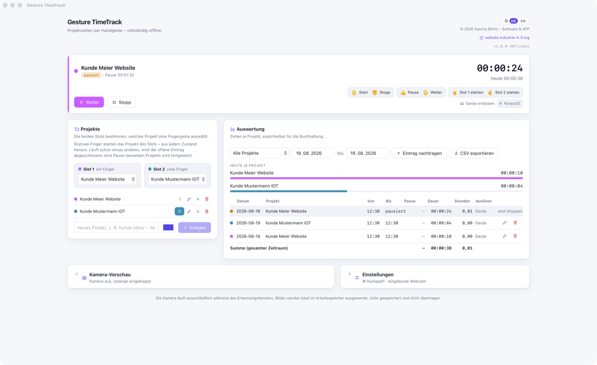

# Gesture TimeTrack

*[Deutsche Fassung](README.de.md)*

Project time tracking by hand gesture – a software replacement for a hardware
time-tracking buzzer. Press the hotkey, hold a gesture up to the camera, keep
working.

**Fully offline.** Camera frames are processed on your device only. No cloud
service, no upload, no account, no stored images. The one optional network path
stays on your own Wi-Fi: a phone used as a camera (see below).



---

## The gestures

| Gesture | Meaning |
|---|---|
| 🖐️ Open hand | **Start** – and **resume** from a break |
| ✊ Fist | **Stop** – the entry is recorded |
| 👍 Thumbs up | **Pause** |
| ☝️ One finger | Start project **slot 1** |
| ✌️ Two fingers | Start project **slot 2** |

Five gestures, no separate “resume”: the open hand does it. One gesture less to
remember, one less way to confuse them.

A slot gesture **starts** tracking from any state. If another project is running
(or paused), its entry is closed with its net time and the new one begins right
away; a break on the same project is resumed. The same works by mouse – the
button in the project list then reads *Switch*.

## How a booking works

1. **Hotkey** (default `Ctrl/Cmd + Alt + Space`) – the camera overlay appears in
   the top right corner without stealing focus from your work window. With
   several displays it appears on the one your mouse is on.
2. The camera runs for the configured window (3 seconds by default).
3. A gesture counts only once it stays above the confidence threshold (85 % by
   default) for **three consecutive frames**.
4. Feedback in the overlay: a green frame means accepted, a red one means not
   recognised. Optionally a short sound.
5. Overlay closes, camera off. When in doubt **nothing** is recorded – there is
   deliberately no fallback to “some” action.

`Esc` cancels the recognition window at any time.

## Optional: your phone as the camera

If your built-in webcam is not up to the job, you can use a **network camera on
your own Wi-Fi** – for instance a phone running any camera app (DroidCam, IP
Webcam, …; no particular app is required or bundled).

*Settings → Camera → Network camera*, then enter the stream address, e.g.
`http://192.168.1.20:4747/video`, and press **Test connection** – the test tells
you in plain words whether a stream arrives and at what resolution. Continuous
MJPEG streams and single-frame addresses (`…/shot.jpg`) both work.

* The stream stays on your local network: the app fetches frames straight from
  the address you entered and evaluates them on this device. No cloud.
* It connects **only** while the recognition window is open, never in the
  background.
* The recognition window defaults to **4 seconds** here instead of 3, because
  MJPEG over Wi-Fi arrives noticeably later. The clock starts with the first
  frame; both values are settings.
* The default path is untouched: without this option the app needs no network at
  all.

Worth knowing: many camera apps serve only **one** stream client. If a browser
tab, OBS or a desktop camera app is already connected, the camera answers with
its own web page instead of images – Gesture TimeTrack says exactly that instead
of showing a black preview.

## Training your own gestures

If a gesture is not recognised reliably with your hand, you can **train** it:
*Camera preview → Start preview →* then *Record* per gesture. After a countdown
you hold the gesture still for about 1.5 seconds and the app stores roughly
20–40 measurements. Once all five gestures are recorded you can switch on *Use
my training*.

How it works: **no images are stored**, only ten proportions of your hand pose
(how straight each finger is, thumb position, distances between fingertips) –
all dimensionless, so independent of hand size and camera distance. Recognition
then uses the nearest neighbour in that feature space. No neural network, no
training run, no extra model file – and every decision can be traced back to one
concrete recording.

Beyond the five base gestures you can add **custom** ones: give it a name, pick
an action (start, stop, pause, resume, slot 1/2 or *start a specific project*),
record it. Custom gestures apply **only** when none of the base gestures was
recognised confidently, so “Stop” can never be overridden by accident.

## Reports and export

All data lives in a single SQLite file in your user’s app data directory
(macOS: `~/Library/Application Support/de.swd.gesture-timetrack/`).

Entries can be **edited and deleted** in the reports card, and added by hand via
*Add entry* – for forgotten time or a misrecognition. Validation happens in the
backend: end after start, break shorter than the entry; the app computes net
time itself. Only the running entry is locked – stop tracking first.

CSV export (semicolon and decimal comma in German, comma and decimal point in
English – so Excel opens it without an import wizard) with date, project, start,
end, duration as `hh:mm:ss` and as decimal hours, break and trigger
(gesture/manual). The project filter applies to the export as well, so you can
bill per client.

## Without gestures

Everything works by mouse too. **Clicking the menu bar icon** opens a small
window right below it: running time, start/pause/resume/stop and the project
list for switching with one click. It closes as soon as it loses focus, like a
menu. Right-click opens the classic menu.

In the macOS menu bar the project name and time run second by second
(`Client · 01:01:01`, paused with `‖`).

## Language

German and English, switched with the **DE|EN toggle** in the window header. The
choice applies to the interface, to all backend messages (tray menu, errors,
overlay feedback) **and** to the CSV export format.

## Install and develop

Requirements: Node ≥ 20, Rust ≥ 1.88, the
[Tauri prerequisites](https://tauri.app/start/prerequisites/).

```bash
npm install          # also fetches the model and WASM runtime into public/
npm run tauri:dev    # development
npm run tauri:build  # build installers
npm test             # frontend tests
npm run test:rust    # backend tests
```

`npm install` downloads the MediaPipe hand model (~7.5 MB) and the WASM runtime
into `public/` once. That is the **only** network access in the whole project,
and it happens at build time, not at runtime. Both end up in the bundle; the
finished app loads nothing.

## Releases and updates

Native packages for **Windows 11** and **macOS** come from the same code base
(`npm run tauri:build`, on the target system each). An annotated version tag
triggers the workflow that builds both and creates a release draft. Details in
[docs/release.md](docs/release.md).

**Updates** come from GitHub Releases and are only ever checked **on demand**
(*Settings → Updates*), never in the background. That check is the only network
access of the finished app, and you trigger it yourself.

## Technology

| Area | Choice |
|---|---|
| App framework | Tauri 2 (Rust) |
| Frontend | Vue 3 + Pinia + Vite |
| Recognition | MediaPipe Hand Landmarker (Tasks Vision, WASM) |
| Classification | own geometric evaluation of the 21 landmarks, plus optional nearest-neighbour training |
| Camera source | built-in webcam (`getUserMedia`) or MJPEG camera on your Wi-Fi |
| Storage | SQLite via `rusqlite` |
| Hotkey / tray | Tauri Global Shortcut plugin, Tray Icon API |

State (running/paused/stopped) lives entirely in the Rust backend – gesture,
tray menu and window all take the same paths. Details:
[architecture](docs/architektur.md), [gestures](docs/gesten.md),
[privacy](docs/datenschutz.md) (German).

## Licence

MIT – see [LICENSE](LICENSE).

© 2026 Sascha Böhm – Software & APP · [website.industrie-4-0.org](https://website.industrie-4-0.org)
